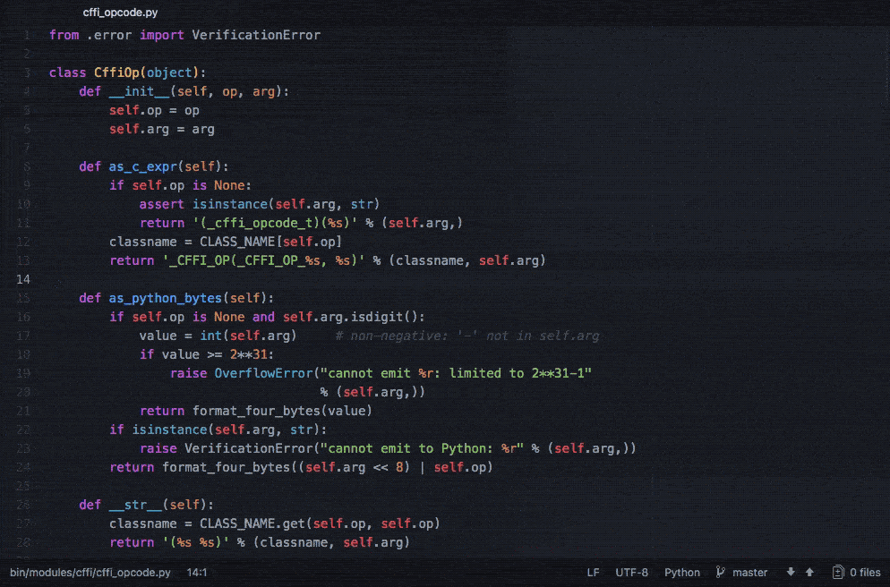

# Execute

Run commands without leaving Atom.

## Features:

- tab autocompletion
- color output
- setting the working directory
- run commands with or without output
- copy and paste the output

## Commands:

| Command                           | macOS Shortcut                  | Linux Shortcut                | Notes                                                 |
|:----------------------------------|:--------------------------------|:------------------------------|:------------------------------------------------------|
| `command`                         | <kbd>cmd-ctrl-r</kbd>           | <kbd>shift-ctrl-r</kbd>       | execute a terminal command                            |
| `background`                      | <kbd>cmd-ctrl-b</kbd>           | <kbd>shift-ctrl-b</kbd>       | execute a terminal command without displaying output  |
| `copy`                            | <kbd>cmd-ctrl-alt-c</kbd>       | <kbd>shift-ctrl-alt-c</kbd>   | copy the output of the last command                   |
| `cwd`                             | <kbd>cmd-ctrl-w</kbd>           | <kbd>shift-ctrl-w</kbd>       | set the current working directory                     |
| `re-run-last-command`             | <kbd>cmd-ctrl-alt-r</kbd>       | <kbd>shift-ctrl-alt-r</kbd>   | run your last executed command again                  |
| `kill-last-command`               | <kbd>cmd-ctrl-alt-x</kbd>       | <kbd>shift-ctrl-alt-x</kbd>   | terminate the last command you ran                    |
| `toggle-panel`                    | <kbd>cmd-ctrl-x</kbd>           | <kbd>shift-ctrl-x</kbd>       | toggle the output panel                               |

### Example

Run tests, installs, or deploys right in Atom

_This package is based on [run-command](https://atom.io/packages/run-command) and [run-command2](https://atom.io/packages/run-command2)_
