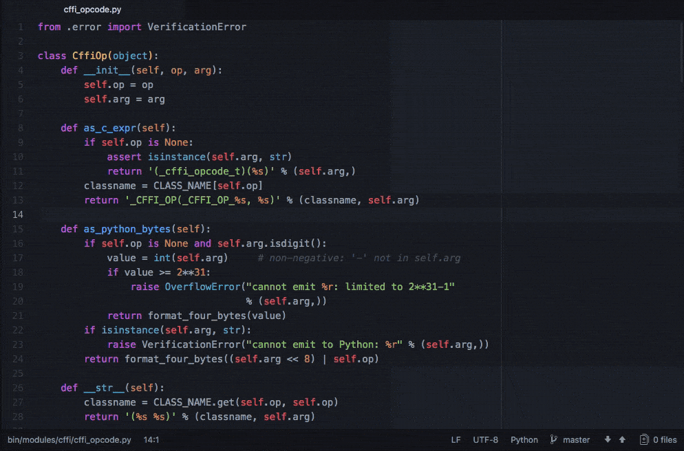

# Execute

Run commands without leaving Atom.

## Commands:

- `command` - execute a terminal command

- `copy` - copy the output of the last command

- `cwd` - set the current working directory

- `re-run-last-command` - run your last executed command again

- `kill-last-command` - terminate the last command you ran

- `toggle-panel` - toggle the output panel

### Example

Run tests, installs, or deploys right in Atom

_This package is based on [run-command](https://atom.io/packages/run-command) and [run-command2](https://atom.io/packages/run-command2)_
